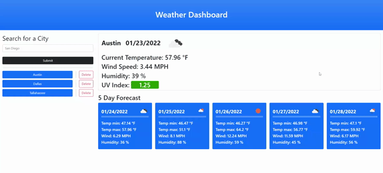
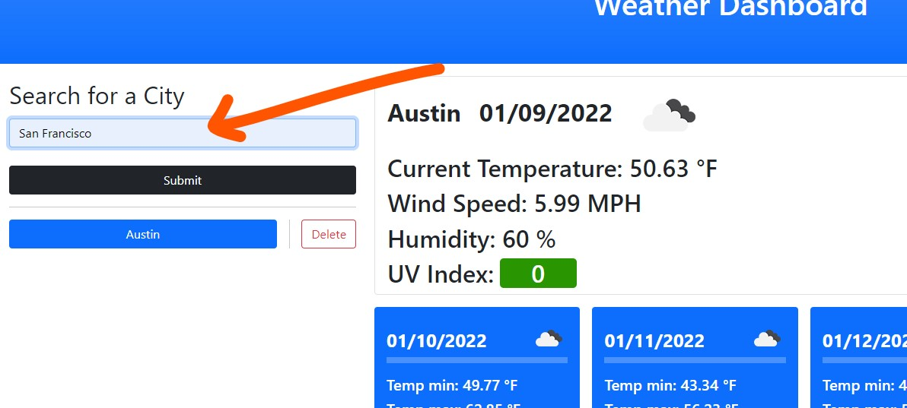
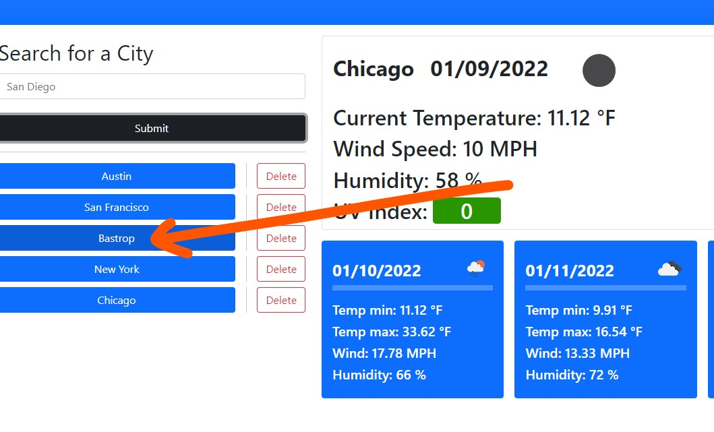
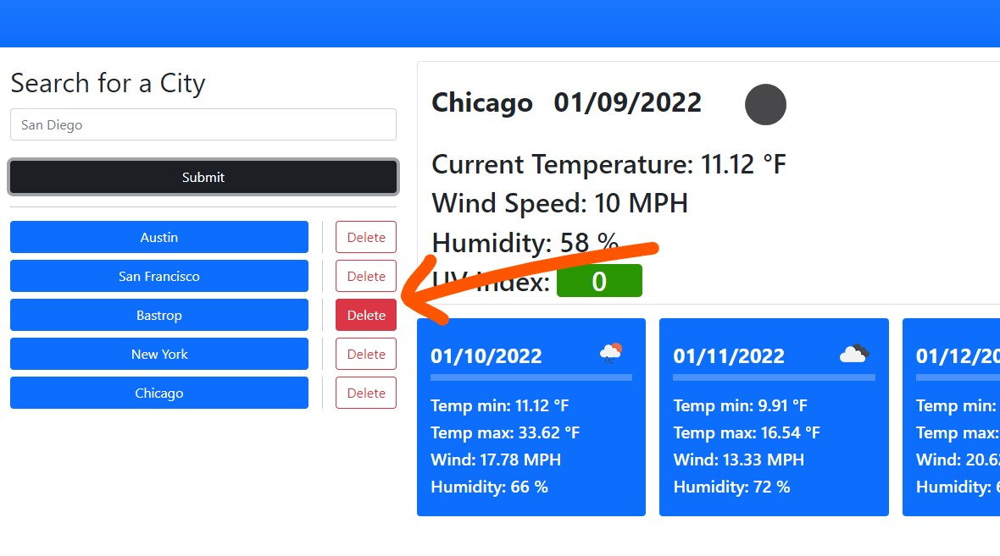

# Weather Dashboard

## Table of Contents
- [Project Goal](#Project-Goal)
- [Links](#Links)
- [Technologies](#Technologies)
- [Screenshot of Application](#Screenshot-of-Application)
- [User Instructions](#User-Instructions)
- [License](#License)
- [Contribution](#Contribution)
- [Acknowledgements](#Acknowledgements)

## Project Goal
Goals for this project include the following: 
1. To create a dashboard that would allow the user to search a city name or location to see the current weather and 5 day forecast for that query.
2. For the application display to be responsive to multiple screensizes.

## Links
- ### [URL to Deployed Application](https://inklein1997.github.io/Weather-Dashboard/)
- ### [URL to Github Repository](https://github.com/inklein1997/Weather-Dashboard)

## Technologies
### Languages and Libraries

### 3rd Party APIs

### Miscellaneou Technologies
- Local Storage

## Screenshot of Webpage

## User Instructions
1. To view weather details and 5 day forecast for location, **Click search box** and **type location**. Please then **click "Submit"** or **press "Enter"** on your keyboard to start the search.  This search will be added to the search history. 

2. Instead of re-typing an already searched city, the user may **click** the desired city button in the search history.  

3. To remove a city from the search history, **click "Delete"**.  

## License
  This project is licensed under the terms of [MIT](https://opensource.org/licenses/MIT).
  
## Contribution
Before contributing to **Weather-Dashboard**, please read this [code of conduct](code_of_conduct.md)[^1]. 
Here's how you can contribute...
1. Add issue or recommendation for improvement to Issues tab on Github.
2. Submit pull request for review.

## Acknowledgements
- Weather APIs provided by [https://openweathermap.org/](https://openweathermap.org/api).
- Special thanks to Catalin Pit for code for that capitalized the first letter of multiple words.  See [here](https://www.freecodecamp.org/news/how-to-capitalize-words-in-javascript/).